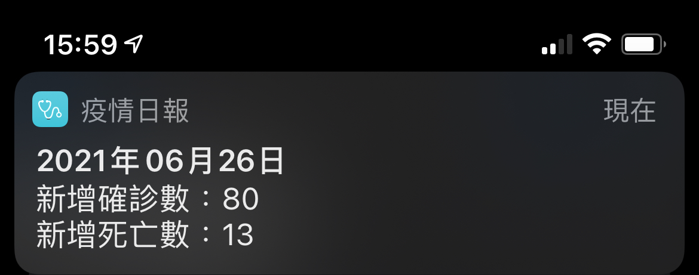
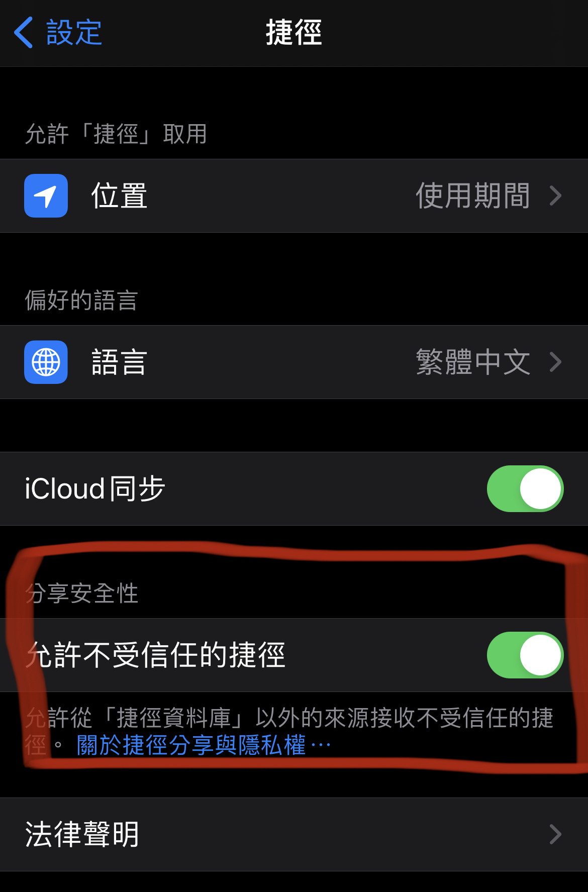
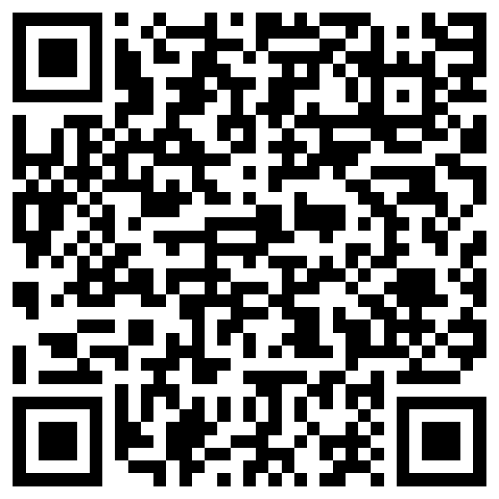
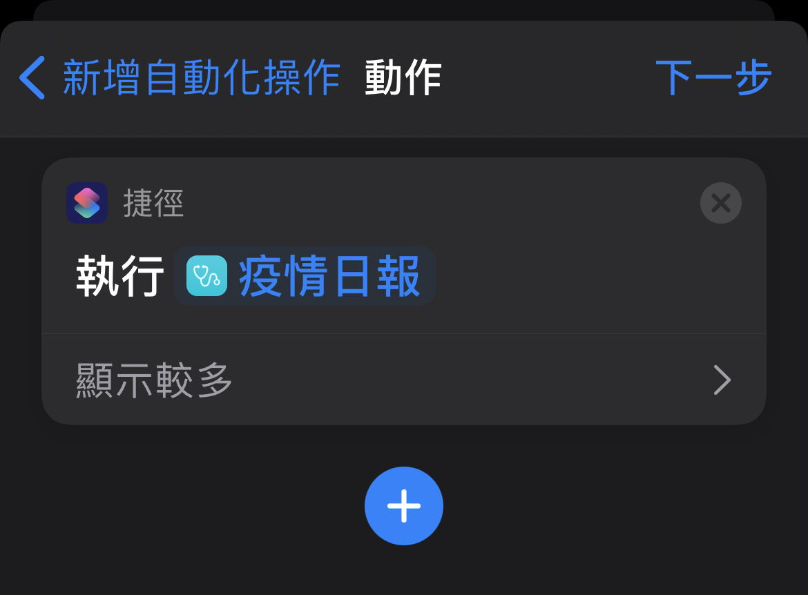
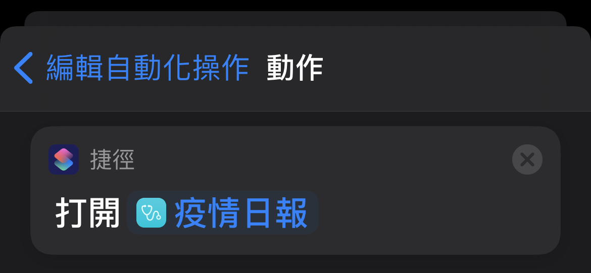
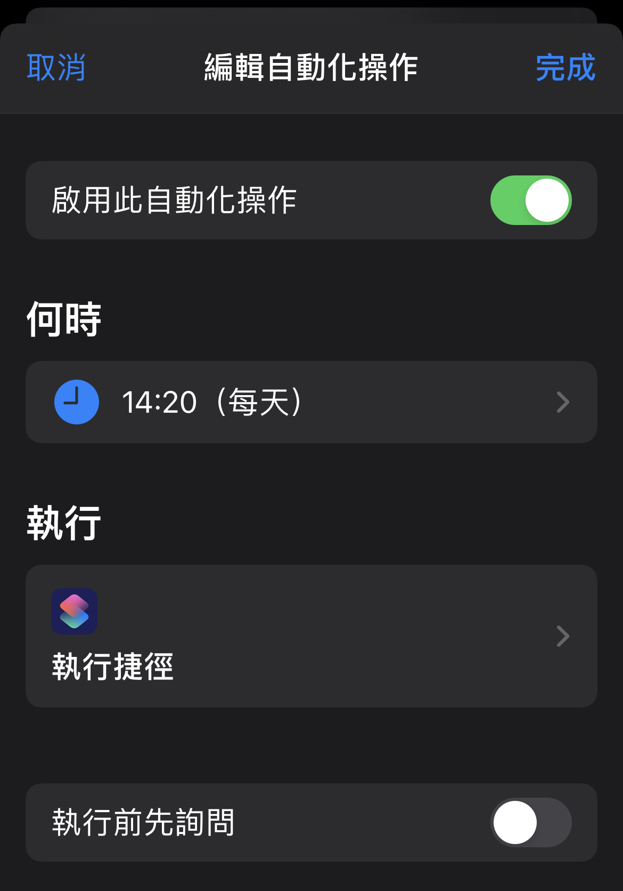

<h1>iOS 疫情日報</h1>

  

## 1. 到「設定」 > 「捷徑」將「允許不受信任的捷徑」點選開啟 

 
註1: 加完本捷徑可自行關閉 
註2: iOS 本身有限制必須要先執行過另一個捷徑才能開啟本設定 
 

## 2. 手機掃描以下 QRcode 加入捷徑「疫情日報」  

  

## 3. 設定自動化   
### (1) 到「捷徑」 > 「自動化」新增一個「每天 14:30」-「打開捷徑」的自動化 

 

### (2)「打開捷徑」設定為剛加入的「疫情日報」 

 

### (3) 其他自動化設定明細如下 

 
